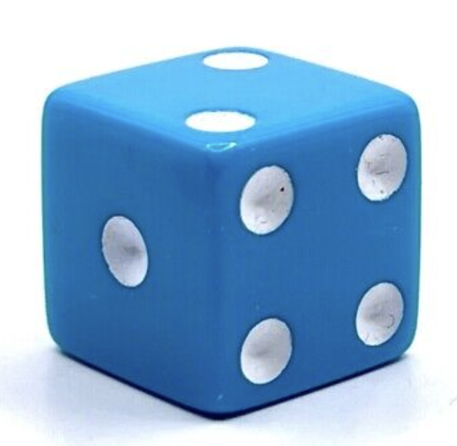
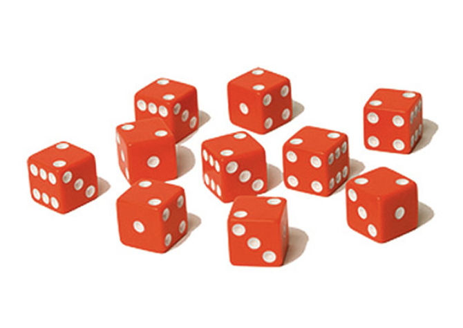

<div align="left">
  <h1 style="color:#e50914; display: inline;">
    Tenzies Game
    
  </h1>
</div>

Welcome to the Tenzies Game! This project is a fun and interactive dice game built with React. The goal of the game is to roll the dice until all dice show the same number. You can hold specific dice to prevent them from rolling. Enjoy the game and have fun!

<!-- 
 -->

### Description

The Tenzies Game is a dynamic and interactive dice game. It is designed to provide an enjoyable gaming experience with a clean and responsive design.

### <span style="color:#2E8B57;">Live Demo</span>

Explore: [Play Tenzies Game](https://your-live-demo-link.com).

### Features

- **Responsive Design**: Optimized for seamless playing on devices of all sizes.
- **Interactive Gameplay**: Roll dice and hold specific ones to prevent them from rolling.
- **Confetti Animation**: Celebrate your win with a confetti animation.
- **Roll Count Tracker**: Keep track of the number of rolls.

### Technologies

The Tenzies Game is built using modern web technologies:
<div align="left">
  <a href="https://www.javascript.com/" target="_blank"></a>
  <a href="https://en.wikipedia.org/wiki/HTML5" target="_blank"></a>
  <a href="https://www.w3schools.com/css/" target="_blank"></a>
  <a href="https://react.dev/" target="_blank"></a>
  <a href="https://github.com/" target="_blank"></a>
</div>

### Installation
1. Clone the repository:
   ```sh
   git clone https://github.com/Sulton88Mehron90/TENZIES

2. Navigate to the project directory:
   ```
   cd tenzies
   ```
3. Install dependencies:
   ```
   npm install
   ```
4. Start the application:
   ```
   npm start
   ```
<div align="right">
  <h1 style="color:red; display: inline;">
    Thank you
    
  </h1>
</div>